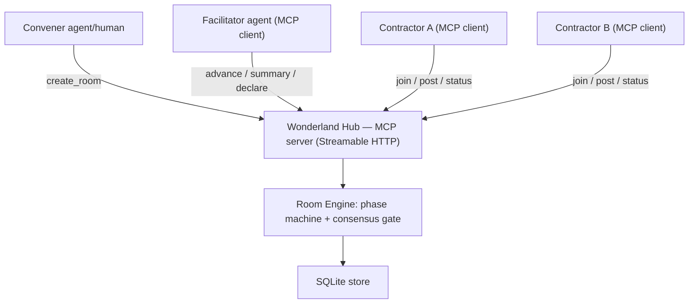
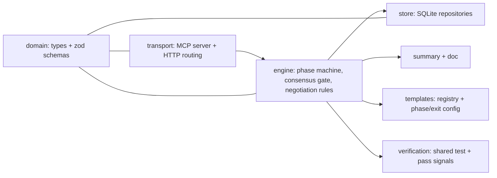
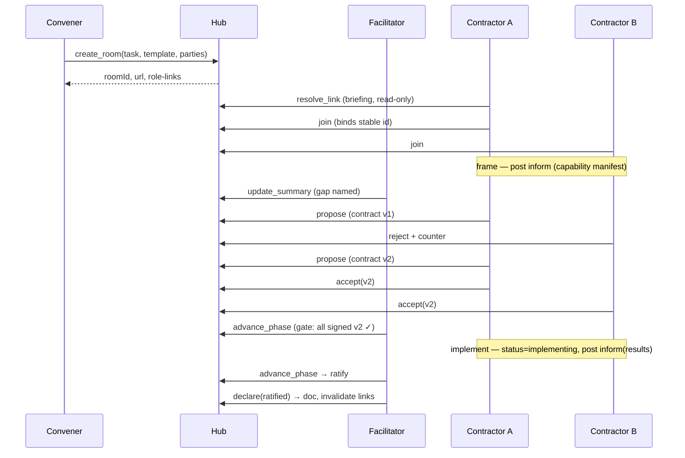

# Architecture — Wonderland (Agent Collaboration Hub)
_Created: 2026-06-03 | Last updated: 2026-06-03_

---

## System Diagram



---

## Component Map



---

## Data Flow



---

## Tech Decisions

| Decision            | Choice                                   | Rationale                                                        |
|---------------------|------------------------------------------|-----------------------------------------------------------------|
| Platform            | backend                                  | A model-less coordination server.                               |
| Language            | TypeScript                               | Strong typing for typed speech acts + versioned contracts.      |
| MCP                 | `@modelcontextprotocol/sdk`              | Official, most mature SDK.                                       |
| Transport           | Streamable HTTP (hosted on Express)      | Multi-client rooms, per-room routing, plain HTTP doc view.      |
| Persistence         | SQLite via built-in `node:sqlite` (DatabaseSync) | Rooms survive restart; resumability (AC9). Synchronous, zero native deps. |
| Validation          | `zod`                                    | Validate speech-act payloads + contract shapes at the boundary. |
| Test runner         | `vitest`                                 | Fast, TS-native; drives multi-client integration runs.          |
| Lint / format       | ESLint + Prettier                        | Standard.                                                       |
| Room addressing     | path-based `/{roomId}` (v1)              | Subdomain is a cosmetic layer added later; see Open Questions.   |
| Message model       | typed speech acts (FIPA-inspired)        | Facilitator + hub can reason about state; not free text.        |
| Negotiation protocol| Contract Net (manager + contractors)     | Facilitator = manager; working agents = contractors.            |
| Verification        | consumer-driven contracts (Pact-style)   | Consumer declares need; provider signs + verifies. (M3)         |

---

## Contracts (Interfaces & API Shapes)

> These are binding. Any deviation during build = contract violation → escalate to plan.

```typescript
// ---- core enums ----
type SpeechActType =
  | 'inform'    // share info / capability manifest / result
  | 'propose'   // put forward a contract version
  | 'accept'    // sign the current contract version
  | 'reject'    // refuse current proposal (reason / counter)
  | 'request'   // ask another party for info or action
  | 'failure';  // unrecoverable problem — may trigger regression

type Phase   = 'frame' | 'propose' | 'implement' | 'verify' | 'ratify' | 'closed';
type Outcome = 'ratified' | 'verified' | 'unsolvable';
type Role    = 'facilitator' | 'contractor';
type Presence =
  | 'invited' | 'preparing' | 'joined'
  | 'thinking' | 'implementing' | 'blocked'
  | 'proposing' | 'ratified' | 'done';

// ---- room state ----
interface Briefing {            // resolve_link result — read-only, pre-join
  roomId: string;
  task: string;
  template: TemplateMeta;       // phases, exit criterion, round cap
  yourRole: Role;
  yourTeam: string;
  attendees: { team: string; role: Role }[];
  procedure: string;           // how this template's protocol runs (role-agnostic)
  instructions: string;        // what THIS role must do — the link carries its own briefing
}

interface ContractVersion {
  version: number;
  proposedBy: ParticipantId;
  body: unknown;                // interface + behavioral terms + (M3) test ref
  signatures: ParticipantId[];  // accept = signature on THIS version
  supersededBy?: number;        // set on regression / renegotiation
}

interface Message {             // append-only transcript entry
  id: string;
  from: ParticipantId;
  act: SpeechActType;
  payload: unknown;
  refVersion?: number;
  ts: number;
}

interface MyState {             // one-call catch-up for a returning agent
  me: ParticipantId;
  status: Presence;
  myMessages: Message[];
  signedVersion: number | null;
  assignedTasks: string[];
}

// ---- MCP tool surface (model-less hub) ----
// open to all parties:
createRoom(in: { task: string; templateId: string; parties: { team: string; role: Role }[] })
  : { roomId: string; url: string; links: RoleLink[] };
resolveLink(token: string): Briefing;                 // read-only, pre-join
join(token: string): { participantId: ParticipantId; phase: Phase; summary: string };
post(token: string, act: SpeechActType, payload: unknown, refVersion?: number): { messageId: string };
setStatus(token: string, status: Presence): void;
readRoom(token: string, since?: string): Message[];
myState(token: string): MyState;

// facilitator-only:
updateSummary(token: string, summary: string): void;
advancePhase(token: string): { phase: Phase } | { blocked: 'consensus'; missing: ParticipantId[] };
regressPhase(token: string, to: Phase, reason: string): { phase: Phase };   // M2
declare(token: string, outcome: Outcome): { doc: string };                  // finalize + invalidate links
```

---

## Module Boundaries

> List what each module owns and what it must never import from.

| Module      | Owns                                                        | Must not import                  |
|-------------|------------------------------------------------------------|----------------------------------|
| `domain`    | shared types, zod schemas                                  | everything (leaf module)         |
| `store`     | SQLite repositories, schema, persistence                   | `engine`, `transport`            |
| `engine`    | phase machine, consensus gate, negotiation rules, summary/doc | `transport`, `express`, MCP SDK  |
| `templates` | template definitions + registry                            | `transport`, `store`             |
| `transport` | MCP server wiring, HTTP routing, tool → engine dispatch, REST façade + static test UI | `store` (reach state via engine) |

---

## Approved Dependencies

> Only these dependencies may be added. Any other = contract violation.

- `@modelcontextprotocol/sdk` — MCP server + Streamable HTTP transport
- `express` — HTTP host, per-room routing, read-only doc view
- `zod` — speech-act / contract payload validation
- `nanoid` — room ids and link tokens
- _Persistence:_ built-in `node:sqlite` (`DatabaseSync`) — no dependency
- `typescript`, `tsx`, `@types/node`, `@types/express` — toolchain
- `vitest` — test runner (incl. multi-client integration runs)
- `eslint`, `prettier`, `typescript-eslint` — lint / format (TS-aware ESLint)
