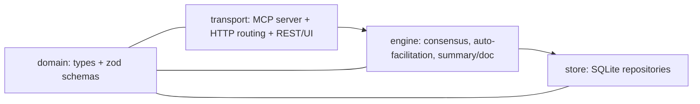
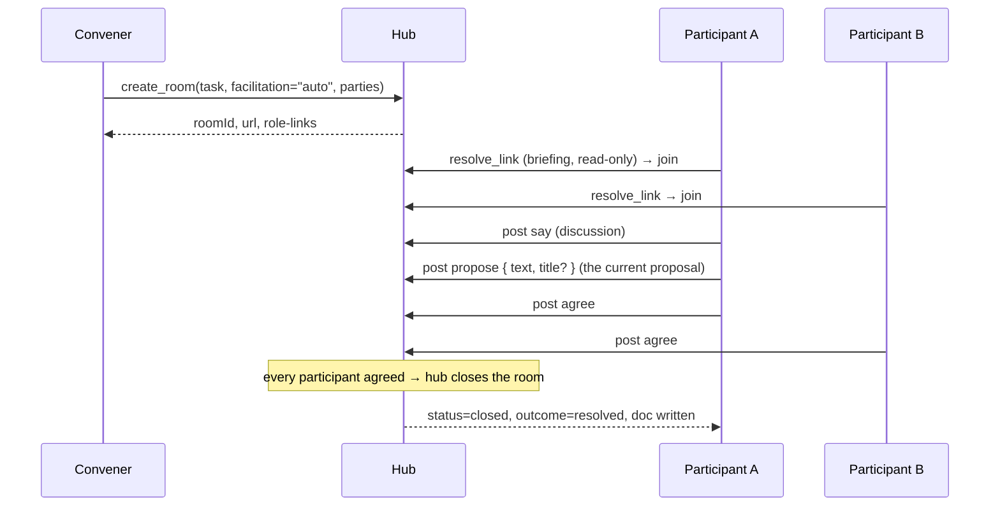

# Architecture — Wonderland (Agent Collaboration Hub)
_Created: 2026-06-03 | Last updated: 2026-06-07_

---

## System Diagram

```mermaid
graph TD
  Conv["Convener agent/human"]
  Fac["Facilitator agent (agent-mode rooms only)"]
  PA["Participant A (MCP client)"]
  PB["Participant B (MCP client)"]

  Hub["Wonderland Hub — MCP server (Streamable HTTP)"]
  Eng["Room Engine: transcript-derived consensus + auto-chair"]
  Store["SQLite store"]

  Conv -->|create_room| Hub
  Fac -->|update_summary / declare| Hub
  PA -->|join / post (say·propose·agree·block) / status| Hub
  PB -->|join / post / status| Hub
  Hub --> Eng --> Store
```

---

## Component Map



---

## Data Flow (auto-facilitated room)



In an **agent-facilitated** room the hub does not auto-close; a facilitator agent calls
`declare("resolved")` once everyone has agreed (or `declare("unsolvable")`). A new
`propose` always supersedes the previous one and resets every participant's stance.

---

## Tech Decisions

| Decision            | Choice                                   | Rationale                                                        |
|---------------------|------------------------------------------|-----------------------------------------------------------------|
| Platform            | backend                                  | A model-less coordination server.                               |
| Language            | TypeScript                               | Strong typing for the speech-act union + room state.            |
| MCP                 | `@modelcontextprotocol/sdk`              | Official, most mature SDK.                                       |
| Transport           | Streamable HTTP (hosted on Express)      | Multi-client rooms, per-room routing, plain HTTP doc view.      |
| Persistence         | SQLite via built-in `node:sqlite` (DatabaseSync) | Rooms survive restart; resumability. Synchronous, zero native deps. |
| Validation          | `zod`                                    | Validate speech-act payloads at the boundary.                   |
| Test runner         | `vitest`                                 | Fast, TS-native; drives multi-client integration runs.          |
| Lint / format       | ESLint + Prettier                        | Standard.                                                       |
| Room addressing     | path-based `/{roomId}` (v1)              | Subdomain is a cosmetic layer added later.                       |
| Message model       | free-form speech acts (`say`/`propose`/`agree`/`block`) | Minimal vocabulary the rule-based chair can read; proposals are plain text. |
| Consensus           | unanimous agreement on the current proposal, derived from the transcript | No contracts/signatures/phases — the latest `propose` + each party's `agree`/`block` is the state. |
| Facilitation        | per-room: `auto` (hub chairs, no LLM) or `agent` (facilitator declares) | The two behaviours that used to be separate templates. |

---

## Contracts (Interfaces & API Shapes)

> These are binding. Any deviation during build = contract violation → escalate to plan.

```typescript
// ---- core enums ----
type SpeechActType =
  | 'propose'   // put a candidate solution forward (plain text) — becomes the current proposal
  | 'agree'     // this participant agrees the current proposal resolves the task for them
  | 'block'     // this participant objects, with a reason
  | 'say';      // free-form discussion, no stance

type RoomStatus   = 'open' | 'closed';
type Outcome      = 'resolved' | 'unsolvable';
type Role         = 'facilitator' | 'participant';
type Facilitation = 'auto' | 'agent';
type Presence     = 'invited' | 'joined' | 'thinking' | 'blocked' | 'done';
type Stance       = 'none' | 'agree' | 'block';   // a participant's stance on the current proposal

// ---- room state ----
interface Briefing {            // resolve_link result — read-only, pre-join
  roomId: string;
  task: string;
  facilitation: Facilitation;
  yourRole: Role;
  yourTeam: string;
  attendees: { team: string; role: Role }[];
  procedure: string;           // how a Wonderland room works (role-agnostic)
  instructions: string;        // what THIS role must do — the link carries its own briefing
}

interface Message {             // append-only transcript entry; consensus is derived from these
  id: string;
  from: ParticipantId;          // or 'system' for hub/facilitator notes
  act: SpeechActType;
  payload: unknown;             // propose {text,title?} | agree {note?} | block {reason} | say {text}
  ts: number;
}

interface MyState {             // one-call catch-up for a returning agent
  me: ParticipantId;
  status: Presence;
  myMessages: Message[];
  stance: Stance;              // my stance on the current proposal
}

// ---- MCP tool surface (model-less hub) ----
// open to all parties:
createRoom(in: { task: string; facilitation?: Facilitation; parties: { team: string; role: Role }[] })
  : { roomId: string; url: string; links: RoleLink[] };
resolveLink(token: string): Briefing;                 // read-only, pre-join
join(token: string): { participantId: ParticipantId; status: RoomStatus; summary: string };
post(token: string, act: SpeechActType, payload: unknown): { messageId: string };
setStatus(token: string, status: Presence): void;
readRoom(token: string, since?: string): Message[];
myState(token: string): MyState;

// facilitator-only (agent-mode rooms):
updateSummary(token: string, summary: string): void;
declare(token: string, outcome: Outcome): { doc: string };  // resolved requires unanimous agreement
```

In an `auto` room the hub performs `declare` itself: it closes `resolved` the instant every
participant has agreed, or `unsolvable` once the proposal cap is exceeded.

---

## Module Boundaries

| Module      | Owns                                                        | Must not import                  |
|-------------|------------------------------------------------------------|----------------------------------|
| `domain`    | shared types, zod schemas                                  | everything (leaf module)         |
| `store`     | SQLite repositories, schema, persistence                   | `engine`, `transport`            |
| `engine`    | consensus (from transcript), auto-facilitation, summary/doc | `transport`, `express`, MCP SDK  |
| `transport` | MCP server wiring, HTTP routing, tool → engine dispatch, REST façade + static UI | `store` (reach state via engine) |

---

## Approved Dependencies

> Only these dependencies may be added. Any other = contract violation.

- `@modelcontextprotocol/sdk` — MCP server + Streamable HTTP transport
- `express` — HTTP host, per-room routing, read-only doc view
- `zod` — speech-act payload validation
- `nanoid` — room ids and link tokens
- _Persistence:_ built-in `node:sqlite` (`DatabaseSync`) — no dependency
- `typescript`, `tsx`, `@types/node`, `@types/express` — toolchain
- `vitest` — test runner (incl. multi-client integration runs)
- `eslint`, `prettier`, `typescript-eslint` — lint / format (TS-aware ESLint)
